Mermaid is a text-based diagram language. You write simple code like this:

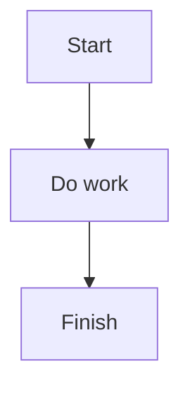

That creates a flowchart:
Start → Do work → Finish

## A simple way to study Mermaid

Focus on these 4 things first:

### 1. Basic flowchart structure

Use:

* `graph TD` = top to bottom
* `graph LR` = left to right
* `A --> B` = arrow from A to B

Example:

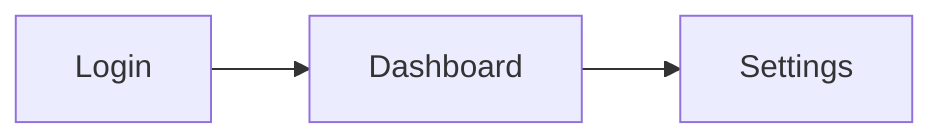

### 2. Node shapes

Different brackets create different shapes:

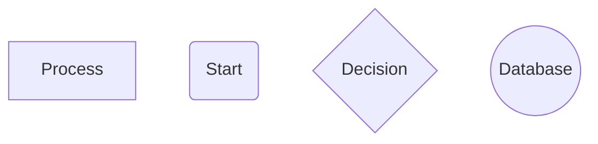

* `[Text]` = rectangle
* `(Text)` = rounded
* `{Text}` = decision diamond
* `((Text))` = circle/database-like

Example:

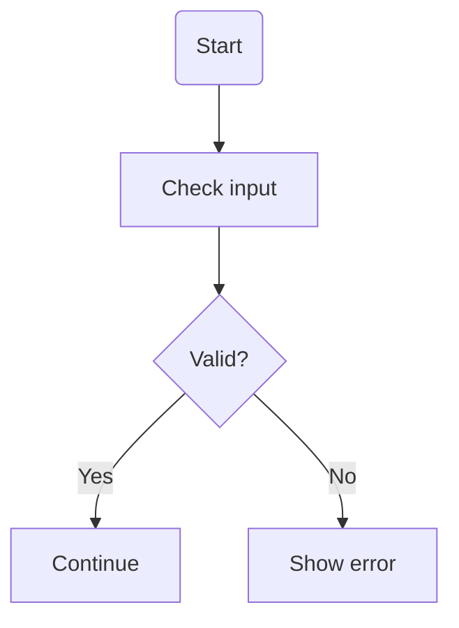

### 3. Labels on arrows

You can label branches:

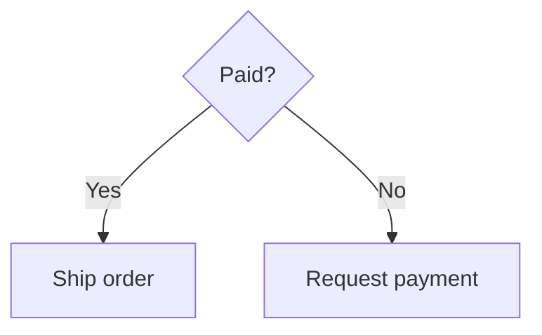

This makes decision flows much clearer.

### 4. Organizing with subgraphs

Use `subgraph` to group parts:

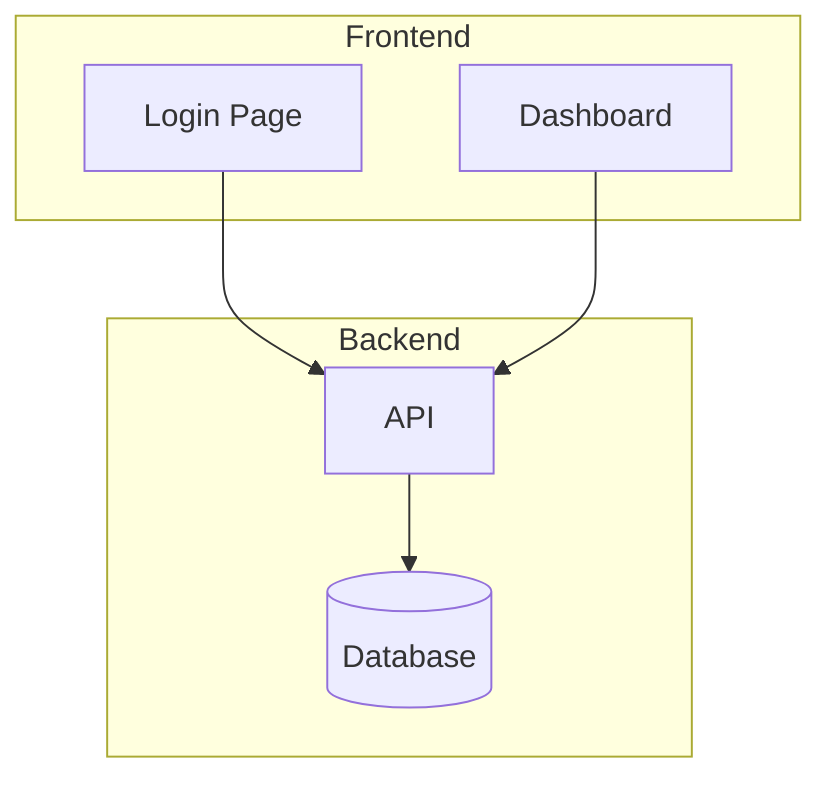

## A good study path

Practice in this order:

1. **Simple arrows**
2. **Shapes**
3. **Decision branches**
4. **Subgraphs**
5. **Styling**
6. **Other diagram types** like sequence diagrams

## Example: bad vs improved diagram

Basic version:

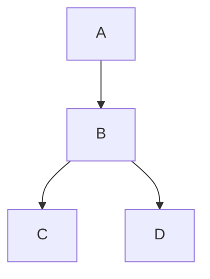

Improved version:

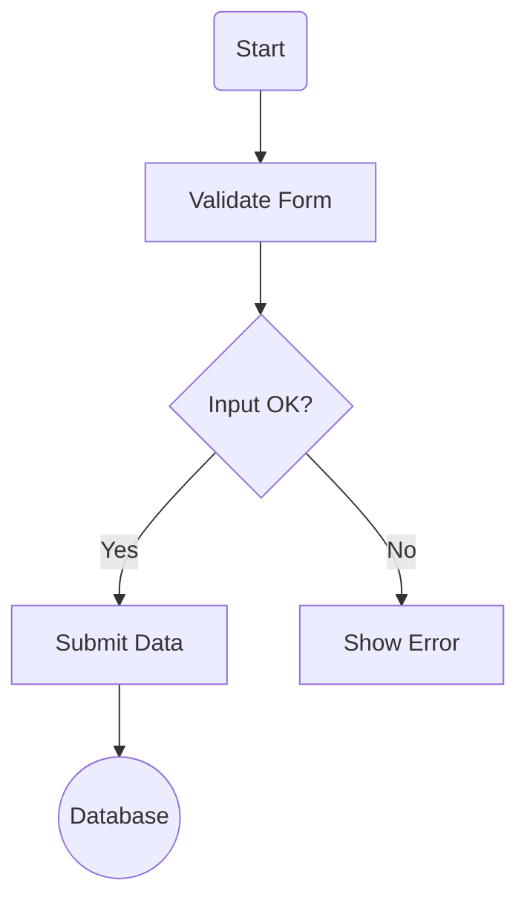

Why it is better:

* clearer node names
* proper decision shape
* labeled logic
* meaningful final target

## Tips to improve your Mermaid drawings

* Use **short labels**
* Use **consistent shapes**
* Use `{}` for decisions
* Prefer `LR` for wide processes and `TD` for step-by-step flows
* Break large diagrams into **subgraphs**
* Do not connect too many lines to one node unless necessary

## 3 useful Mermaid examples

### Flowchart

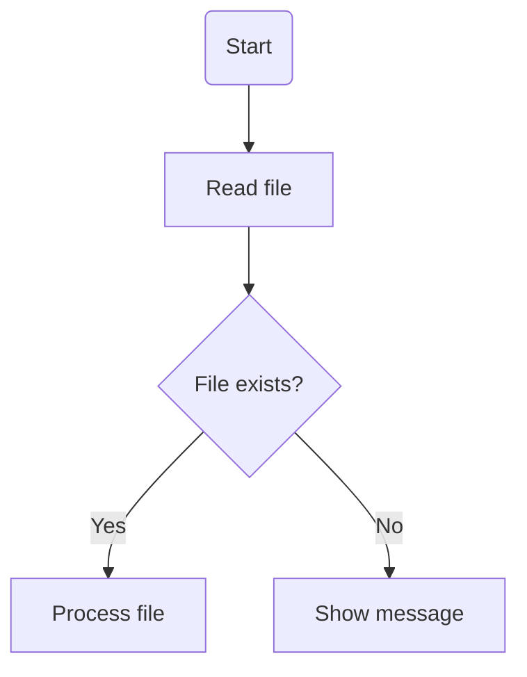

### Sequence diagram

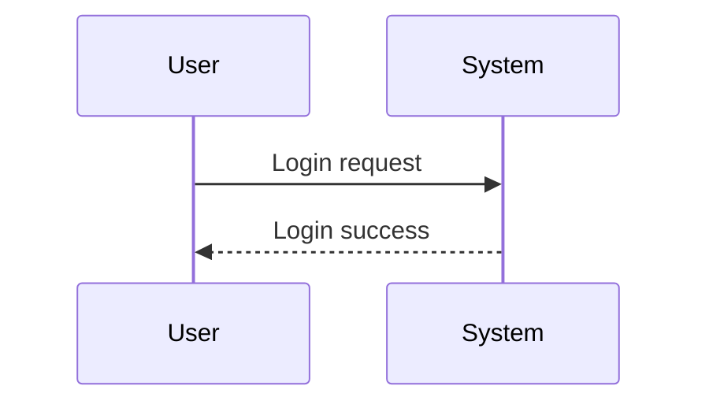

### State diagram

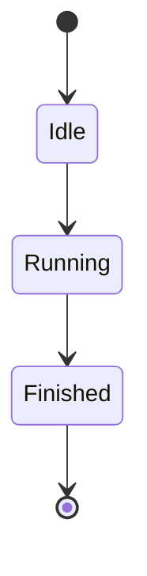

## Practice exercise

Try turning this process into Mermaid:

* User opens app
* App checks login
* If logged in, show dashboard
* If not logged in, show login page

Answer:

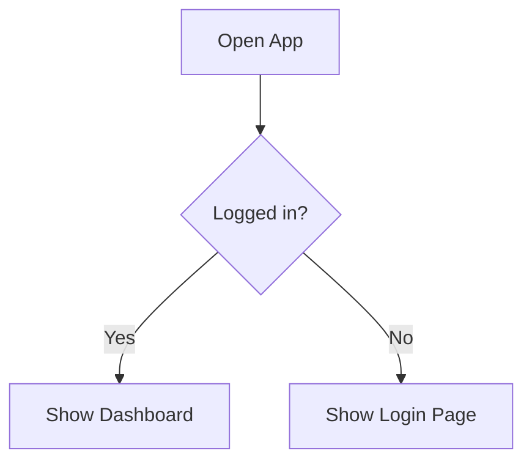

## A simple template you can reuse

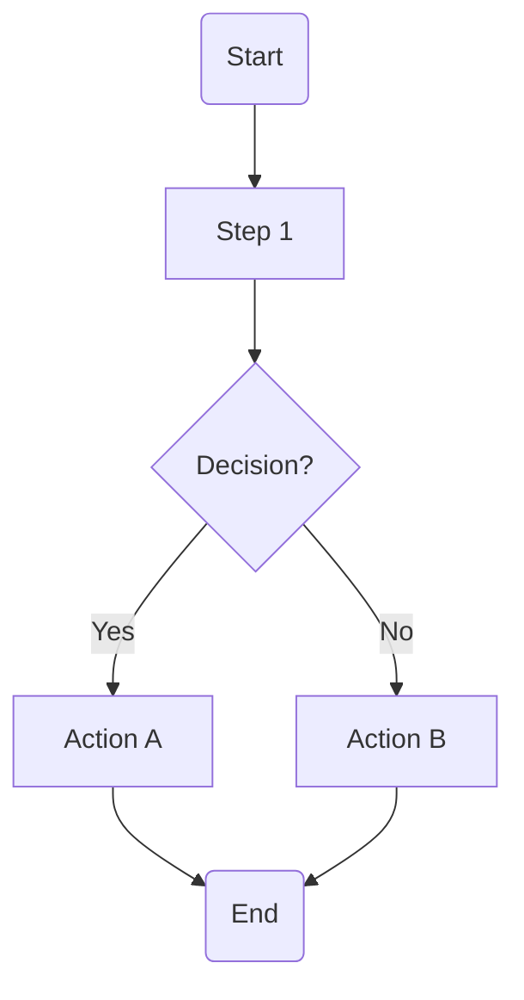

